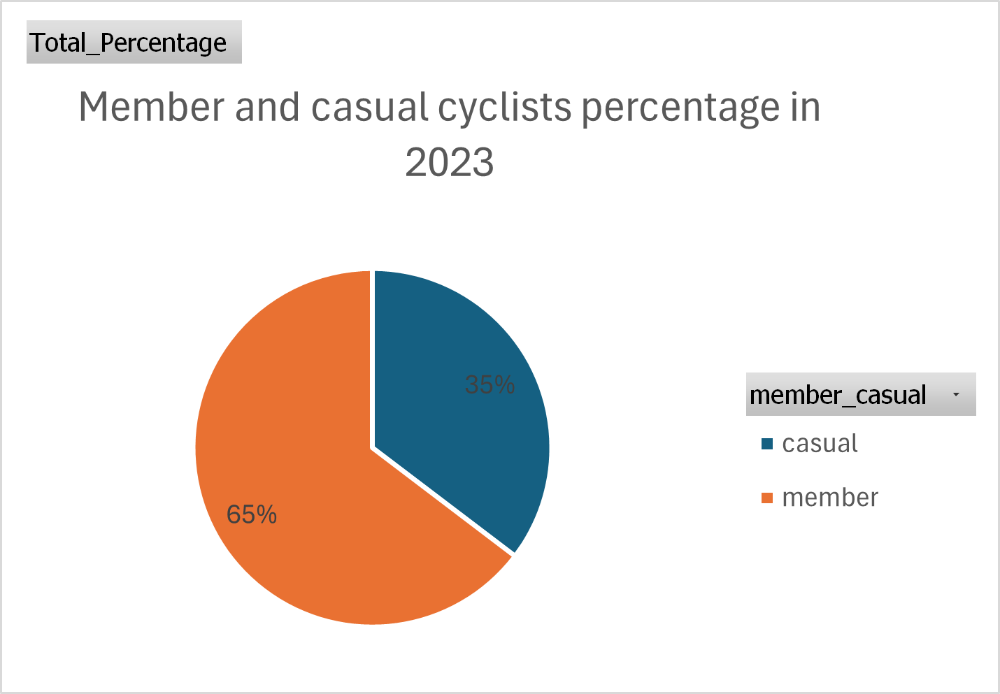
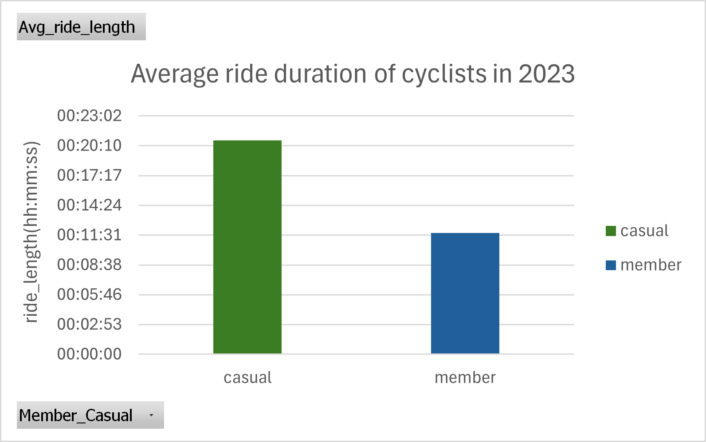
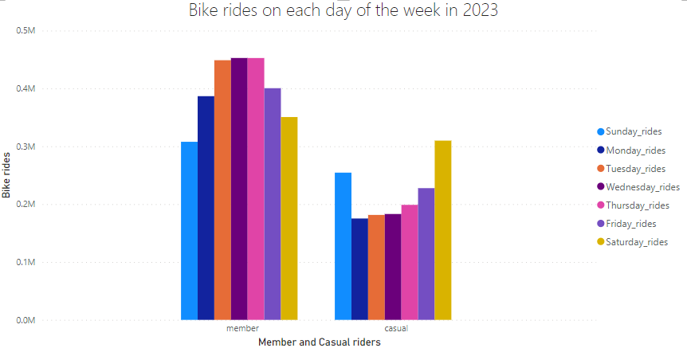
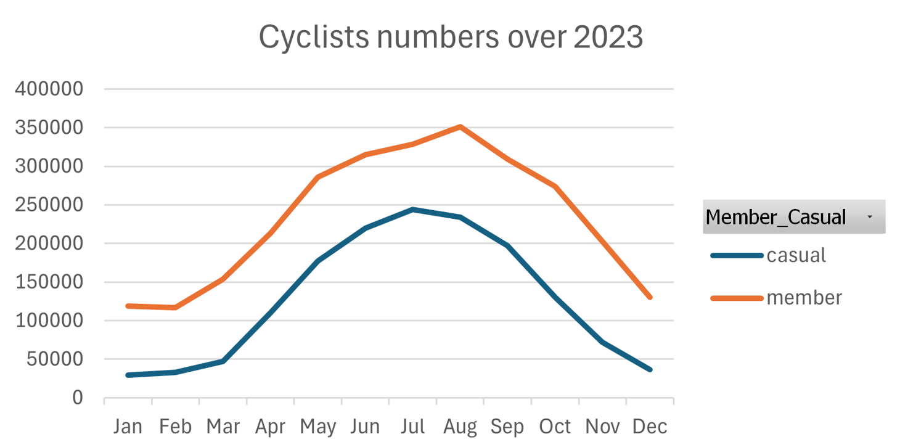

# Cyclists bike_trips  analysis

## Table of Contents

  - [Project Overview](#project-overview)
  - [Data Sources](#data-sources)
  - [Tools](#tools)
  - [Data Cleaning/Preparation](#data-cleaningpreparation)
  - [Exploratory Data Analysis](#exploratory-data-analysis)
  - [Data Analysis](#data-analysis)
  - [Analysis Findings/Results](#analysis-findingsresults)
  - [Recommendations](#recommendations)
  - [Limitations](#limitations)
  - [References](#references)

### Project Overview

The goal of this project is to analyze bike trips data of a company, which rents different types of bikes to people and it has two types of customers, annual member riders and casual riders. The main objective is to identify how do annual members and casual riders use bikes differently in an attempt to convert the casual riders into annual members.

This data analysis project focuses on various bike_trip data aspects which help in determining data insights, identifying trends and patterns to make data-driven recommendations.

### Data Sources

Cyclists bike_trip data: [cyclists tripdata](https://divvy-tripdata.s3.amazonaws.com/index.html)(The data is a public source and owned by Motivate International Inc. under this [license](https://divvybikes.com/data-license-agreement)). For this project, the whole 12 months data for 2023 is considered for the analysis.

### Tools

- Excel - Data cleaning, manipulation and analysis
- SQL server - Data analysis(wrote a few queries)
- Excel and Power BI - Visualizations

### Data cleaning/Preparation

In the first stage, below are taken care:
1. Downloaded and inspected the quality of data.
2. Missing values are addressed and checked for duplicates.
3. Data is cleaned and formatted for accuracy and consistency.

### Exploratory Data Analysis

In this process, we need find out the answers to below questions:

- What is the total casual and annual members count?
- How their average ride length look like?
- Are there any trends or patterns that tell us the rise or fall of the rides?
- How was the trend on an average day of the week?

### Data Analysis

Data is analysed in excel using functions like average, max and percentage etc. and as a part of analysis pivot tables are created for the summary.
Analysis is viewed through SQL(wrote a few queries), an example below:

```sql
SELECT member_casual, day_of_week, COUNT(ride_id) as total_rides
FROM biketrip_jandata
GROUP BY member_casual, day_of_week;
```
### Analysis Findings/Results

1. Though the annual members were the highest number of customers(shown in Image1) for the company in 2023, casual riders are riding the longest(shown in Image2).


    

    > Image1 and Image2


2. Casual riders renting the most bikes during weekends while members do it on weekdays.


    

   > Image3


   
3. Bike trips tend to rise between Quarter2 and Quarter3 .


     

    >Image4


### Recommendations

1. Can initiate a marketing campaign to convert casual riders into members considering their ride time.
2. Any special offers or benefits on the membership can be implemented during weekends.
3. Accomodating more resources like bikes, docked stations and staff during Q2 and Q3.

### Limitations

1. I removed the blank values of start and end station columns because it would affect the accuracy of the insights.
2. A bike type called docked_bike for casual riders was found only for the first 3 Quaters and it is missing for the last quarter and also it does not show the docked_bike data for the annual members, because of the lack of data and to maintain accuracy, the variable was not taken into account in the analysis. Also, this variable has outliers as its range is way out of the other bike types.
3. Individual datasets are large and saved in .csv which has become hard to combine, so analysis has been performed separately and the summary of the data has been merged [bike ride data](2023_bike_tripdata_summary_v2.xlsx). You can find individual sheets in [Google Drive link](https://drive.google.com/drive/folders/1MU2fdGMciMQiaQpBbv5R_-_PlAvcqynG) .

### References

1. Google Data analytics certification capstone project in Coursera
2. SQL - [SQL learnings](https://www.w3schools.com/sql/sql_syntax.asp)


